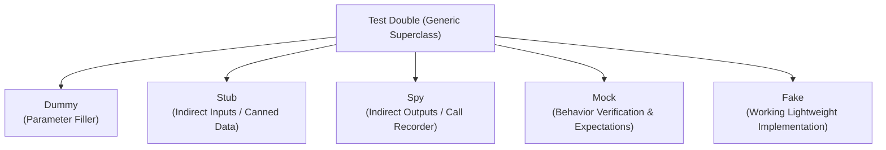

# Week 5 — Test Doubles Architecture & Taxonomy

## 1. Test Double Taxonomy (Gerard Meszaros / Martin Fowler)

In automated testing, real production dependencies (such as credit card processors, live databases, or third-party email APIs) are often slow, non-deterministic, expensive, or destructive. **Test Doubles** replace these dependencies in a controlled manner.

The canonical taxonomy defines five distinct test double categories:

### Definitions & Characteristics:

1. **Dummy:** Objects that are passed around but never actually used or called (e.g., placeholder tokens or unused arguments needed to satisfy method signatures).
2. **Stub:** Provides **pre-programmed, canned answers** to calls made during the test. Stubs do not verify behavior; they provide controlled indirect inputs to the System Under Test (SUT).
3. **Spy:** A wrapper or recorder that **logs invocations and parameters** (indirect outputs) without affecting execution. Assertions are made *after* execution (e.g., verifying `emailSpy.getSentEmailCount() === 1`).
4. **Mock:** Pre-programmed with **behavioral expectations** (which methods must be called, with what exact arguments, in what sequence). Mocks perform *behavior verification* rather than state verification.
5. **Fake:** Has a **working business implementation**, but takes shortcuts unsuitable for production (e.g., an in-memory `Map` database instead of a distributed PostgreSQL cluster).

---

## 2. Subsystem Test Double Justification Table

| Subsystem | Selected Test Double | Implementation Class | Architectural Justification |
| :--- | :---: | :--- | :--- |
| **Customer Database** | **FAKE** | `FakeCustomerDatabase` | Needs realistic state storage, record indexing, and lookup behavior for customers and orders, while allowing in-memory resets between tests without spinning up a real database. |
| **Payment Gateway** | **MOCK** | `MockPaymentGateway` | Payment processing is safety-critical. We must verify exact charge parameters (`amount`, `currency`, `customerId`, `orderId`), control outcomes (`SUCCESS`, `DECLINED`, `TIMEOUT`), and ensure no live charges occur. |
| **Inventory Service** | **STUB** | `StubInventoryService` | We need deterministic indirect inputs (products that are in-stock, low-stock, or out-of-stock) to test conditional branching in the checkout pipeline without querying a warehouse ERP. |
| **Email Notifier** | **SPY** | `SpyEmailNotifier` | Email dispatch is an indirect side-effect. We must record all sent messages to assert that *exactly one* confirmation email is sent on success, and *zero* emails on payment failure. |

---

## 3. Detailed Double Implementations in the Project

### A. The Fake: `FakeCustomerDatabase` (`src/doubles/fakeCustomerDatabase.js`)
- Maintains internal `Map` collections for customers and orders.
- Provides `findById()`, `hasCustomer()`, and `saveOrder()`.
- Supports test hooks: `setSimulateSaveFailure(true)` to trigger simulated I/O errors and verify compensation rollbacks.

### B. The Mock: `MockPaymentGateway` (`src/doubles/mockPaymentGateway.js`)
- Records array of charge and refund invocations.
- Allows programmatic configuration of outcomes: `setBehavior('DECLINED')`, `setBehavior('ERROR')`.
- Provides verification assertions:
  - `verifyChargeCalledWith({ customerId, amount, currency, orderId })`
  - `verifyNoCharges()`

### C. The Stub: `StubInventoryService` (`src/doubles/stubInventoryService.js`)
- Pre-seeded with known test items: `prod-in-stock` (100 units), `prod-low-stock` (2 units), `prod-out-of-stock` (0 units).
- Returns controlled stock counts and performs in-memory reservations for testing business logic.

### D. The Spy: `SpyEmailNotifier` (`src/doubles/spyEmailNotifier.js`)
- Records structured email payloads in `sentEmails[]`.
- Exposes query and inspection methods:
  - `getSentEmailCount()`
  - `wasEmailSentTo(email)`
  - `verifyExactlyOneEmailSentTo(email, orderId)`
  - `verifyNoEmailsSent()`
