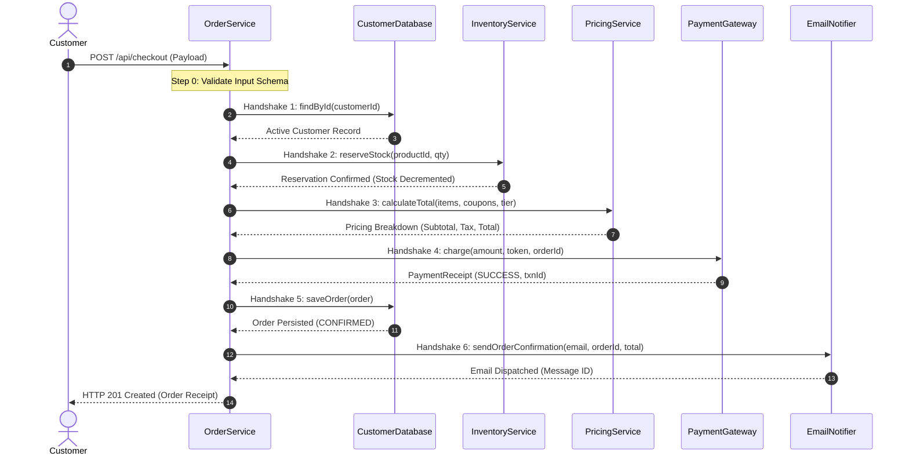
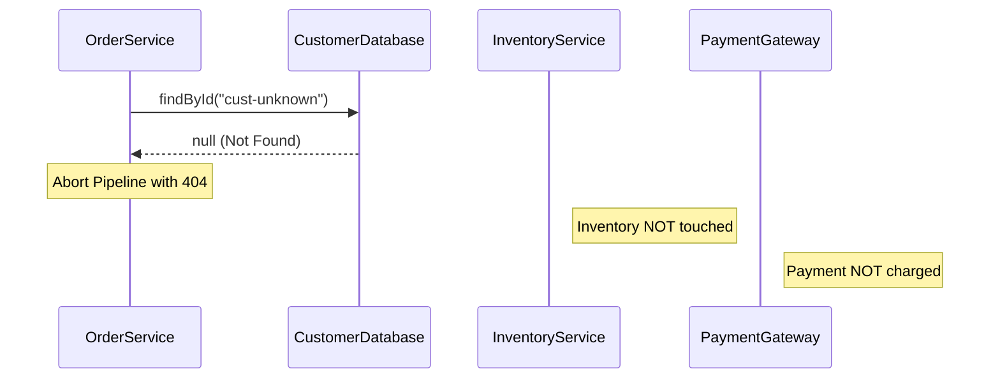
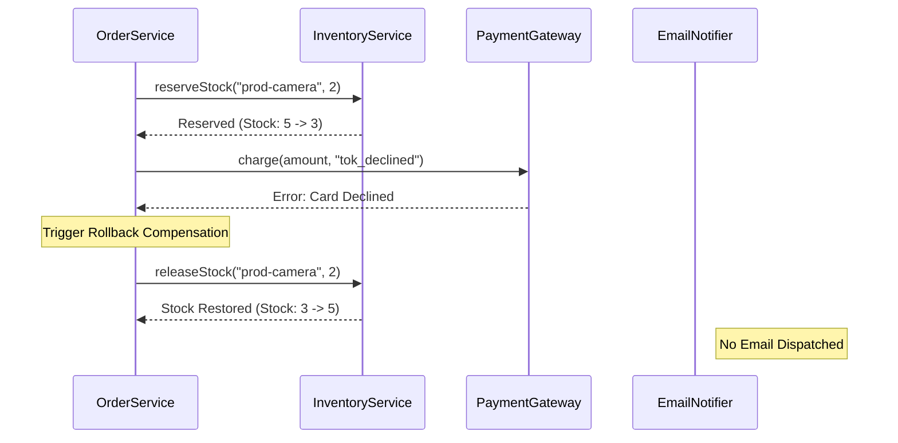
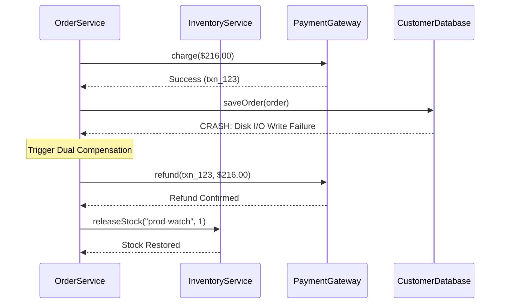

# Week 6 — Integration & Handshake Testing

## 1. Handshake Testing Concept

In distributed systems and microservice architectures, **Integration Handshake Testing** verifies that two or more interacting subsystems communicate according to predefined sequential protocols, and that failure at any point in the protocol leaves the system in a consistent, non-corrupted state.

---

## 2. Happy Path Handshake Sequence Diagram

When a customer executes a valid checkout request, all 6 subsystems execute in strict linear sequence:

---

## 3. Failure Handshakes & Rollback Compensation

The integration test suite (`tests/integration/handshake.test.js`) validates four critical failure boundaries:

### Failure Handshake 1: Customer Database Miss
- **Scenario:** Customer ID does not exist in `CustomerDatabase`.
- **System Action:** Throws `CustomerNotFoundError` immediately at Step 1.
- **State Consistency Check:**
  - Zero inventory reserved.
  - Zero payment charges attempted.
  - Zero orders saved.
  - Zero confirmation emails sent.

---

### Failure Handshake 2: Out-of-Stock Product
- **Scenario:** Product requested has insufficient stock in `InventoryService`.
- **System Action:** Throws `OutOfStockError` at Step 2; releases any partially reserved items.
- **State Consistency Check:**
  - Inventory remains intact.
  - No payment authorization attempted.
  - No database write or email dispatch.

---

### Failure Handshake 3: Declined Payment & Inventory Rollback
- **Scenario:** `PaymentGateway` returns `DECLINED` or card error at Step 4.
- **System Action:** Catches payment failure, triggers rollback to `InventoryService.releaseStock()`, and re-throws `PaymentDeclinedError`.
- **State Consistency Check:**
  - Reserved stock is restored to pre-transaction level.
  - Order is **NOT** marked as confirmed or saved.
  - Confirmation email is **NEVER** sent.

---

### Failure Handshake 4: Database Save Failure & Payment Refund Compensation
- **Scenario:** Payment succeeds at Step 4, but `CustomerDatabase.saveOrder()` crashes at Step 5.
- **System Action:** SUT issues automatic **Compensation Refund** to `PaymentGateway.refund()` and releases reserved inventory.
- **State Consistency Check:**
  - Customer is not billed for an unsaved order.
  - Stock is restored.
  - Error is propagated to caller as HTTP 500 (`PersistenceError`).

